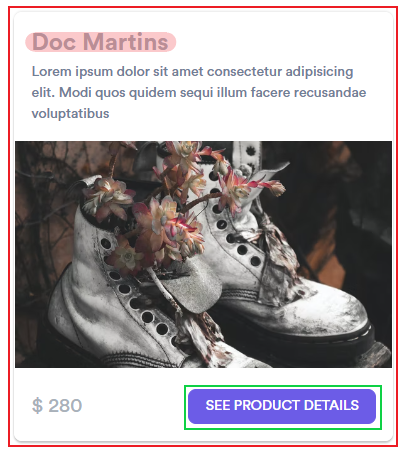

# Locators avancés
Créons un test avec l'aide de Codegen.
1. Allez sur le site <https://bit-shoe-store.netlify.app>
2. Dans les chaussures pour femmes
3. A la fin de la liste, il y a des des chaussures "Doc Martins"
4. Cliquez pour accéder à la page des détails du produit
5. Sélectionnez la taille 39 et la couleur noire
6. Ajoutez les chaussures au panier
7. Accédez à la page du panier
8. Vérifiez que le prix total est de 280

> ℹ️ **note**  
> C'est facile de cliquer sur élément pour avoir le Locator et ensuite écrire une assertion s'en servant

Que notez vous ?
## getByText
Pour accéder au panier de manière plus robuste, plusieurs options. Essayons avec Codegen pour tester plusieurs Locators.

Consultons la documentation  
<https://playwright.dev/docs/api/class-framelocator#frame-locator-get-by-role>

```ts
getByRole('link', { name: 'Cart (1)' })
getByRole('link', { name: 'Cart' })
getByRole('link', { name: 'Cart', exact: true })
getByRole('link', { name: /Cart \(\d+\)/ })
```

## Compte, boucle, listes

## Filter pour trouver le bon élément
Le Locator généré par Codegen pour les "Doc Martins".
```ts
await page.locator('div:nth-child(14) > .card_card__3PD-S > .shoes-card_card__XNGLs > .shoes-card_footer__14csi > .button_button__1z7bF').click();
```

Commençons par trouver toutes les cartes. Nous allons ensuite filter pour trouver celle qui contient le texte "Doc Martins".

<https://playwright.dev/docs/locators#filtering-locators>
## Chainer les Locators
Nous avons un Locator robuste pour la carte des "Doc Martins". Pour trouver le bouton dans cette carte, nous allons chainer les locators.



<https://playwright.dev/docs/locators#chaining-locators>

---
Solution
```ts
import { test, expect } from '@playwright/test';

test('test', async ({ page }) => {
  await page.goto('https://bit-shoe-store.netlify.app/');
  await page.getByRole('link', { name: 'Women' }).click();
  await page
    .locator('.card_card__3PD-S')
    .filter({ hasText: 'Doc Martins' })
    .getByText('see product details')
    .click();
  await page
    .getByRole('combobox', { name: 'Choose a size:' })
    .selectOption('39');
  await page.getByTestId('black').click();
  await page.getByRole('button', { name: 'Add to Cart' }).click();
  await page.getByRole('link', { name: 'Cart' }).click();
  await expect(page.getByTestId('test-currency')).toContainText('280');
});

```

---
Références  
<https://playwright.dev/docs/api/class-page#page-get-by-text>  
<https://playwright.dev/docs/best-practices>  
<https://playwright.dev/docs/locators>
